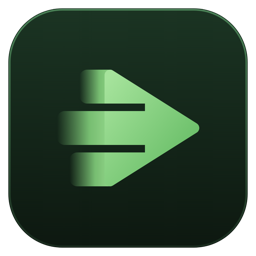
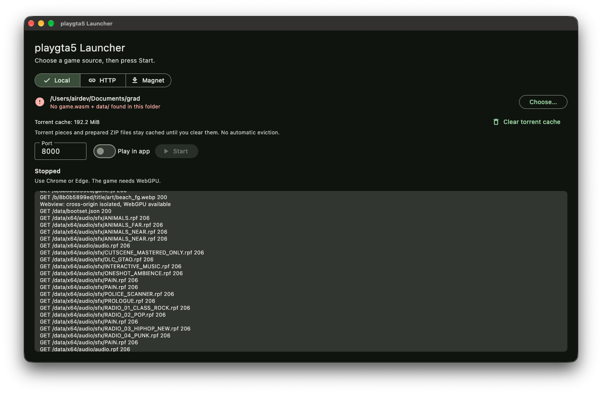

# playgta5 Launcher

[](https://github.com/dev-gyata/gta-launcher/actions/workflows/release.yml)

A desktop app for Windows, macOS and Linux that serves local folders, remote HTTP mirrors, and magnet-linked torrents through a localhost game server. It replaces running `serve_local.py` / `Launch-Local.cmd` by hand, and it doesn't need Python.

> **Disclaimer:** This is an unofficial, independent project. It is not affiliated with, endorsed by, or sponsored by any game publisher or developer, and all trademarks belong to their respective owners. The launcher does not include the game engine, game data, or game artwork. You are responsible for only loading files you have the legal right to use.

## Screenshots



Launcher on macOS. The selected local folder is invalid, so Start is disabled until a compatible mirror is chosen.

## Downloads

Grab the latest binaries from [GitHub Releases](https://github.com/dev-gyata/gta-launcher/releases/latest):

| OS | File | Contents |
| --- | --- | --- |
| Windows (x64) | `playgta5-launcher-windows-x64.zip` | Extract the whole folder and run `playgta5_launcher.exe` |
| macOS (arm64) | `playgta5-launcher-macos-arm64.zip` | Apple Silicon: unzip and move `playgta5_launcher.app` to Applications |
| Linux (x64) | `playgta5-launcher-linux-x64.tar.gz` | Contents of `build/linux/x64/release/bundle/` — extract and run `playgta5_launcher` |
| Android (phones and tablets) | `playgta5-launcher-android.apk` | Sideload the APK, see [Installing on Android](#installing-on-android) and [Phones and tablets](#phones-and-tablets) |
| iPad / iPhone (iOS 26+) | `playgta5-launcher-ios-unsigned.ipa` | Unsigned: sideload it with your own Apple ID, see [Installing on iPad and iPhone](#installing-on-ipad-and-iphone) |

Every `v*` tag (e.g. `v1.0.0`) builds all five binaries in CI and attaches them to that tag's release. Manual runs from the Actions tab build and upload artifacts without publishing by default; enable `publish` explicitly to publish a draft release.

The site's web files (`index.html`, `loader.js`, `game.js`, the workers and manifests) come with the launcher in `site/`. No game engine or game data is included or distributed with the launcher. To play, point it at a local folder, HTTP mirror, or torrent of files you are entitled to use, containing `playgta5.com/b/8b0b5899ed/game.wasm` and `playgta5.com/data/`. Wherever a file exists in both places, the launcher's copy in `site/` is used.

## Platform setup

Downloaded releases include the torrent engine. Users do not need Flutter, CMake, OpenSSL, Python, or a torrent client. Normal operation does not require administrator access. You need read access to local game files, writable application-support storage, and enough free space for persistent torrent and prepared ZIP caches. HTTP mirrors and magnets need internet access. Browser playback requires WebGPU support from both the browser and graphics hardware; use a current Chrome or Edge with hardware acceleration available.

### macOS

The downloadable macOS release targets Apple Silicon (arm64), with a macOS 12 minimum. Extract the ZIP and move the app to Applications. Current builds are ad-hoc signed, without Developer ID signing or Apple notarization, so Gatekeeper may block the first launch. If you trust the release, attempt to open it, then use **System Settings → Privacy & Security → Open Anyway** and confirm. See [Apple's instructions for opening downloaded apps](https://support.apple.com/en-hk/102445).

macOS may ask for access when you choose a mirror in a protected folder such as Documents, Desktop, or Downloads. Grant access to the folder you intend to use. The app sandbox is disabled, but normal filesystem permissions and macOS privacy controls still apply.

In-app playback uses WKWebView and requires WebGPU and cross-origin isolation. If the system webview cannot run the game, use **Open in browser** or turn off **Play in app**.

### Windows

Extract the entire ZIP before launching `playgta5_launcher.exe`; keep its DLLs and data folder alongside it. In-app playback needs the WebView2 Runtime. It is normally present on Windows 11 and many Windows 10 systems, but is not guaranteed on every installation. If missing, install the **Evergreen Runtime** from [Microsoft's official WebView2 download page](https://developer.microsoft.com/en-us/microsoft-edge/webview2/), or use browser playback. The launcher falls back to the browser if WebView2 is unavailable.

Windows may show a [SmartScreen warning for an unfamiliar release](https://learn.microsoft.com/en-us/windows/apps/package-and-deploy/smartscreen-reputation). Torrent networking can also trigger a firewall prompt or be restricted by an existing firewall policy. If needed, allow this app on the trusted network you use; see [Microsoft's firewall guidance](https://support.microsoft.com/en-us/windows/security/windows-security/firewall-and-network-protection). Managed computers may require an administrator to change those policies.

### Linux

Extract the complete archive and keep the `bundle/` contents together, including `lib/` and `data/`. Run `playgta5_launcher` inside that folder. If extraction loses the executable permission, run `chmod +x playgta5_launcher` from the same folder.

The app needs GTK 3 runtime libraries, typically installed on desktop distributions. If missing, install your distribution's GTK 3 runtime package (for example, `libgtk-3-0` or `libgtk-3-0t64` on Debian/Ubuntu, depending on the release). Linux always opens the game in your browser; use Chrome or Edge on a system with WebGPU support.

### Phones and tablets

The Android app runs the same game server on the device and opens the game in Chrome. Android's built-in WebView cannot give the game the shared memory it needs. Whether a phone or tablet can actually run the game depends on its hardware, and most phones today cannot:

- A current Chrome with WebGPU. The game runs as a 32-bit build on Android (converted once on first start, then cached): it is steadier and a little faster than the 64-bit one.
- A graphics chip with WebGPU **BC texture support** (`texture-compression-bc`). The game's textures are stored in that format, and most phone GPUs (Adreno, Mali) don't support it; some high-end tablets do.
- About 8 GB of RAM: the game reserves 3 GB at start.
- About 20 GB of free storage for the game data.

Before loading anything, the game page checks these and names whatever is missing, instead of showing a black screen (`?nocheck=1` skips the check).

Sources on Android are **HTTP** and **Local**. For Local, **Choose…** asks once for Android's **All files access** (the game data is read by path, which the system folder picker cannot give), then opens a folder browser: open the folder that holds `playgta5.com` (a green tick shows when it is found) and press **Use this folder**. If you decline the permission, the launcher uses its own folder instead (`Android/data/com.playgta5.playgta5_launcher/files/game`, filled over USB or with `adb push`). Torrents are desktop only for now.

If the game says *WebGPU found no usable graphics adapter*, Chrome may be hiding WebGPU on that graphics chip. **Turn on WebGPU in Chrome** in the launcher copies `chrome://flags/#enable-unsafe-webgpu` and opens Chrome (apps cannot open Chrome's settings pages directly): paste it into the address bar, set **Unsafe WebGPU Support** to **Enabled** and tap **Relaunch**. The setting is experimental and can make Chrome less stable, and it does not add BC texture support a chip lacks.

While the game plays in Chrome, a **Game server running** notification keeps the server alive (Android would otherwise stop it in the background); its **Stop** button stops the server. The server also stops by itself when you close the app (swipe it away from recent apps) and when the game's Chrome tab has been closed for 5 minutes.

#### iPad and iPhone

The iOS app runs the game server on the device and plays the game inside the app (iOS suspends apps in the background, so the game cannot be moved to Safari). Every iOS browser and in-app view uses Apple's WebKit, which has no 64-bit WebAssembly: on first start the game page converts `game.wasm` to 32-bit memory with the bundled binaryen.js (about 15 seconds to a minute, once; the result is cached), then runs it. The same path makes the game work in Safari on a Mac. Your game files are not modified. Requirements:

- iOS/iPadOS 26 or newer (WebGPU in WebKit).
- An M-series iPad (iPad Pro or Air) is the realistic target: BC textures and about 8 GB of memory (the game uses about 3 GB of its 4 GB limit). Phones and older iPads will most likely run out of memory.

Sources are **HTTP** and **Local**. For Local, either press **Choose…** and pick the folder that holds `playgta5.com` (on the device, iCloud Drive or a USB drive; the launcher remembers it), or copy `playgta5.com` into **On My iPad › playgta5 Launcher › game** with the Files app or with Finder on a Mac (iPad selected › Files), which the launcher uses by default.

#### Installing on Android

1. Download `playgta5-launcher-android.apk` on the device (or copy it over).
2. Open it; Android asks to allow installing apps from that source (your browser or file manager): allow it, then tap **Install**.
3. Updates install the same way over the existing app.

#### Installing on iPad and iPhone

The iOS download is **unsigned**: Apple only lets signed apps run, so you sign it with your own Apple ID while installing. With a free Apple ID the app must be re-signed every 7 days (at most 3 such apps at a time); a paid Apple Developer account ($99/year) makes it last a year.

With **Sideloadly** (Mac or Windows):
1. Install [Sideloadly](https://sideloadly.io) and connect the iPad with a cable (tap **Trust** on the iPad).
2. Drag `playgta5-launcher-ios-unsigned.ipa` into Sideloadly, enter your Apple ID, and press **Start**.
3. On the iPad, turn on **Settings › Privacy & Security › Developer Mode** (it restarts), then trust your Apple ID under **Settings › General › VPN & Device Management**.
4. Open **playgta5 Launcher**. Repeat step 2 within 7 days with a free Apple ID.

With **AltStore** (refreshes the 7-day signing over Wi-Fi): install AltServer on your Mac or PC as described at [altstore.io](https://altstore.io), install AltStore on the iPad from it, then in AltStore **My Apps › +** open the `.ipa`. Developer Mode and trusting your Apple ID work as above.

If you have a paid developer account, you can also build and install it yourself from this repository: `cd ios && open Runner.xcworkspace`, choose your team under **Signing & Capabilities**, select the iPad and press Run.

macOS builds and startup have been checked locally. Windows and Linux build/runtime verification still require their respective hosts; the release workflow is configured to build them.

## Usage

1. Choose a source:
   - **Local**: click **Choose…** and select `mirror`, `mirror/playgta5.com`, or their parent folder.
   - **HTTP**: paste a public folder URL such as `https://example.com/mirror/`. The launcher checks that URL and its `playgta5.com/` and `mirror/playgta5.com/` children. The host must expose file sizes through HEAD and support byte-range GET requests. Cloud sharing pages, authentication, and query-bearing URLs are not supported.
   - **Magnet**: paste a `magnet:?xt=…` link. Markdown-formatted links copied from chat are normalized without visiting the embedded websites; repeated tracker parameters are retained. A bundled libtorrent engine retrieves metadata and only the pieces covering requested game bytes.
2. Click **Start**. On macOS and Windows the game opens inside the launcher window. On Linux it opens in your browser. Use Chrome or Edge there because the game needs WebGPU. **Stop** also cancels metadata discovery, ZIP preparation, and mirror selection.

Torrents may contain an unpacked mirror or a ZIP archive with the same files. If several compatible mirror roots are found, the launcher asks you to choose one. ZIP64 is supported. Stored (uncompressed) ZIP entries stream directly; Deflate-compressed entries are downloaded and extracted individually before their first random read. The engine is checked/prepared before the game opens. Large compressed data files can still take time to prepare during play; the launcher log shows progress. Encrypted archives, split ZIPs, other compression methods, and unsafe paths are rejected.

Torrent pieces, resume state, and verified extracted entries persist in the application's support directory under `torrent-cache/`. The cache display reports allocated disk space, including sparse payloads, and **Clear torrent cache** removes it while stopped. There is no automatic eviction. Stopping closes peer connections and leaves cached data for the next launch. Browser data caches are isolated by source and mirror root.

Automated checks use generated fixture torrents and local seeders, not public torrents.

**Game options** sets how the game starts and runs, on every platform: start mode (ask, Story Mode, Sandbox Mode on either map) and new game, graphics profile (automatic, low memory, full), shadows in low memory, render scale, frame rate cap (60, 30, uncapped), the FPS counter, controller mode, touch controls, camera sensitivity, skipping the device check, and the engine build (32-bit by default on phones and tablets, where 64-bit can be chosen on Android; automatic on desktop: 64-bit in Chrome and Edge, 32-bit in Safari). The launcher passes them to the game page as URL options (`?mode=`, `?low=`, `?scale=`, `?fps=`, `?showfps=`, `?pad=`, `?touch=`, `?padsens=`, `?nocheck=`, `?mem32=`), so they also work by hand in a browser.

The game screen has buttons for **Launcher** (back), **Reload**, **Open in browser** and **Full screen**. You can switch the **Play in app** toggle off to always use the browser instead.

If the webview can't run the game, a banner appears with an Open in browser button. The app remembers the source choice, separate values for each source, port, and play mode. Saved folder settings from earlier versions remain usable. If the port is busy, it uses a free one and shows the address.

### Controller

Xbox, PlayStation and other standard controllers work in the launcher window and in the browser. The game uses the controller as a real gamepad: analog sticks and triggers, the console button layout (D-pad down opens the character wheel, LB the weapon wheel), on-screen prompts that switch to controller buttons once you press one, and vibration. Keyboard and mouse keep working alongside it, and prompts switch back when you use them.

On the start screen, A picks Story Mode, X picks Sandbox Mode and B goes back. Vibration needs browser support: Chrome and Edge (including the Windows app) support it; the macOS app depends on the system WebKit version.

The launcher drives the game's own gamepad support through engine memory for build `8b0b5899ed`, without changing any game files. If that is unavailable it falls back to translating the controller into keyboard and mouse input (digital movement, keyboard prompts, no vibration). URL options: `?pad=keys` forces that fallback, `?padsens=1.5` sets its camera speed, and `?pad=0` turns the controller off.

### Touch controls

On the start screen, tap **Story Mode** or **Sandbox Mode** (the buttons are enlarged on touch screens), or set the start mode in **Game options**. On phones and tablets an on-screen gamepad appears once the game world is up, and the game treats it as a controller (controller prompts, wheels, vehicles); menus that want Enter take **A**:

- **Left side:** a move stick appears where your thumb lands.
- **Right side:** drag to look around.
- **Buttons:** A/B/X/Y bottom right, LT (aim, brake) and RT (fire, accelerate) above them, LB (weapon wheel) and RB in the top corners, a D-pad on the left (up: phone, down: character wheel), L3/R3, and View/Menu at the top.

The device vibrates where the game would rumble a controller. The controls hide while a physical controller is connected and never appear on desktops or touchscreen laptops. `?touch=1` forces them on (for testing), `?touch=0` turns them off, and `?padsens=` also scales the look speed.

## Build

Requires Flutter 3.44+, CMake 3.20+, a C++17 toolchain, and static OpenSSL development libraries for the target architecture. Build each OS on that OS. On macOS, install CMake and run `bash tool/release/build_openssl_macos.sh`; it builds checksum-verified static OpenSSL 3.6.4 for arm64 and macOS 12. On Linux install CMake, the C++ compiler, and `libssl-dev` (or your distribution's equivalent). On Windows use Visual Studio C++ tools and CMake, then run `vcpkg install openssl:x64-windows-static --x-install-root=.dart_tool/native_dependencies/vcpkg` from the repository root.

`packages/torrent_engine` vendors checksum-verified libtorrent 2.0.15 and Boost 1.85.0 header archives. Its native build hook compiles a self-contained library and Flutter packages it with the app; users do not need a torrent client or OpenSSL installation. Incremental native build outputs are cached under the package's `.dart_tool/native_build/`. The first test/build takes longer because it compiles libtorrent.

Build each OS on that OS:
```
flutter pub get
flutter build windows   # build/windows/x64/runner/Release/
FLUTTER_XCODE_ARCHS=arm64 flutter build macos # build/macos/Build/Products/Release/playgta5_launcher.app
flutter build linux     # build/linux/x64/release/bundle/
```
On Linux you need the usual Flutter desktop packages: `clang cmake ninja-build pkg-config libgtk-3-dev`.
The supplied macOS dependency script builds arm64. For an Intel source build, prepare x86_64 static OpenSSL targeting macOS 12, update `openssl_root_macos` below, and use `FLUTTER_XCODE_ARCHS=x86_64`. Build one architecture per invocation.

OpenSSL paths are configured under `hooks.user_defines.torrent_engine` in the root and native package pubspecs. `openssl_root_windows` and `openssl_root_macos` resolve relative to their pubspec; `cmake_executable` optionally selects a custom CMake executable. These user defines survive Dart's filtered build-hook environment. Setting `OPENSSL_ROOT_DIR` alone does not configure Flutter builds. Linux uses automatic system discovery; standalone CMake builds still accept `-DOPENSSL_ROOT_DIR=…`.

### Releasing a new version

CI (`.github/workflows/release.yml`, Flutter stable) builds Windows, macOS (arm64), Linux (x64) and Android on their own runners and publishes the archives to [GitHub Releases](https://github.com/dev-gyata/gta-launcher/releases):

```
# 1. Bump `version:` in pubspec.yaml, move CHANGELOG.md's Unreleased entries under the new version, and commit
# 2. Tag and push — the tag name becomes the release name
git tag v1.0.0
git push origin v1.0.0
```

Pushing a `v*` tag creates (or updates) that tag's release with the binaries; its description is the version's CHANGELOG.md section (the build fails if there is none), followed by GitHub's generated notes and auto-generated notes. To test without tagging, run the workflow from the Actions tab: leave `publish` disabled to verify all desktop builds without creating a release. Enable it only when you intend to publish a draft; `version` optionally selects its tag, otherwise the draft uses `manual-build-<run>`. Windows/macOS native integration and bundle compatibility checks run before packaging, and both extracted archives are checked. The Foundation plugin is constrained below 2.6 to avoid Flutter's macOS 13 native-asset minimum.

To publish a build that already ran, without rebuilding (for example the branch build of a PR you just merged), run the workflow on `main` with `from_run` set to that run's ID, `version` set to the new tag and `publish` enabled (disabled makes a draft). It only publishes if that run succeeded and built exactly the same files as the selected branch.

Build caches: the compiled torrent engine and OpenSSL are cached per runner image and keyed only on what changes them (the engine's sources and build scripts). GitHub shares a branch's caches only with that branch, so the build jobs also run on `main` when native code or the workflow changes, and weekly, to keep warm caches that every branch and tag can use. The Flutter SDK is downloaded, not cached (its 2 GB caches crowded the 10 GB limit).

## Development

```
flutter analyze
flutter test                                  # server, sources, ZIP, settings, UI tests
node test/site/worker_cache_test.cjs            # browser worker cache isolation
dart run tool/serve.dart <mirror/playgta5.com> 8000   # run the server without the UI
```

| Path | Purpose |
| --- | --- |
| `lib/server/mirror_server.dart` | HTTP server: COOP/COEP/CORP headers, byte ranges, `POST /data/batch` |
| `lib/server/site_files.dart` | Maps each URL path to its file in `site/` |
| `site/` | The site's web files, bundled as Flutter assets |
| `lib/server/range.dart` | `Range` header parsing |
| `lib/services/mirror_validator.dart` | Finds the site root (needs `game.wasm` + `data/`) |
| `lib/sources/` | Local/HTTP/torrent adapters, magnet normalization, ZIP range index/extraction |
| `lib/services/source_manager.dart` | Source discovery, mirror selection, persistent torrent cache |
| `packages/torrent_engine/` | Bundled libtorrent C ABI, generated FFI, worker and native tests |
| `lib/services/settings.dart` | Saves source values, port and play mode |
| `lib/ui/launcher_page.dart` | The launcher screen |
| `lib/ui/game_page.dart` | In-app game view (embedded webview) |
| `lib/services/in_app_support.dart` | Detects whether in-app play works on this OS |

The current macOS build cannot be distributed through the Mac App Store because its sandbox is disabled. Public distribution with fewer Gatekeeper prompts requires Developer ID signing and notarization; the current release workflow does not perform those steps.

The native engine has a generated fixture/local seeder test in `packages/torrent_engine/`; its README documents native integration checks and binding regeneration. Automated tests do not require the example torrent or public seeders. HTTP batch responses are assembled by the launcher, so an HTTP mirror does not need `/data/batch` support.

CI caches the Flutter SDK and pub packages through `flutter-action`, static OpenSSL installations, native libtorrent/engine compilation, and CocoaPods downloads. Native cache keys include the runner OS, architecture, image/toolchain version, and dependency configuration; source changes restore compatible objects and let CMake rebuild changed files. OpenSSL caches use exact configuration keys and are saved before application verification. Tests, bundle checks, and packaging still run on every build. The first run for a new configuration fills the caches; later runs reuse them. Final app bundles and extracted verification directories are rebuilt rather than cached.
